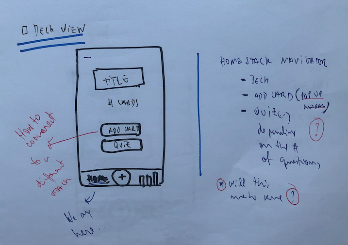
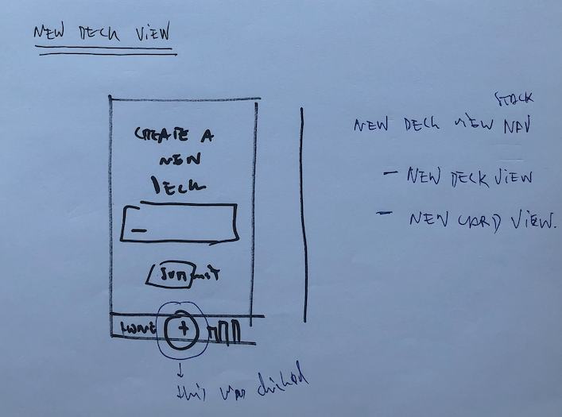
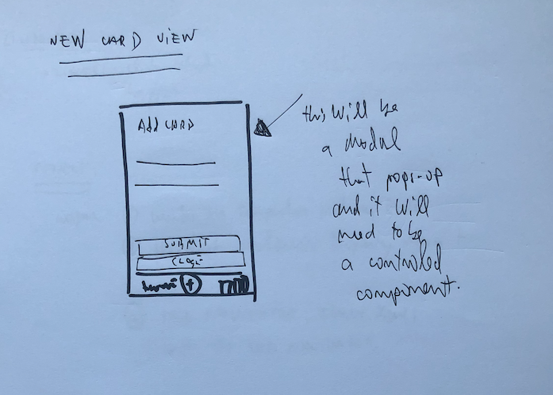
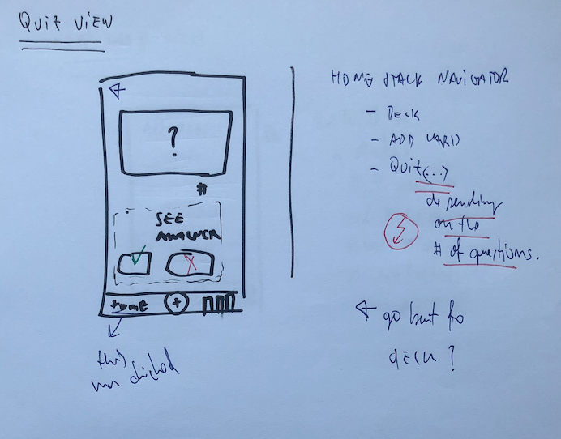

# Flashcards - A App built with React Native

This is UDACITY React nanodegree capstone project #3.

## Installation

To get started and test my project do as follows:

- install project dependencies with `yarn install` or `npm install`
- start the development server with `yarn start` or `npm start`

## The Project approach

This time around I was a little bit more clumsy in the way I planed building this app. I didn't necessarily follow through the recommendations and jump a couple of things that I learn to like thinking on the fly instead of putting together a very sophisticated and detailed plan. In short, I was more keen to code than to think...Def don't recommend that for more complex applications as this will lead to a lot of rework.

Having said that I clearly had in my mind a plan, and idea on how I should go about doing this:

1. 📐 Draw the app views;
2. 📲 Thought about how they would flow and connect;
3. 🧰 More or less broke down how the differ component's will build the views;
4. 📉 Barely thought about the data...

For me the drawing piece is always one of the most interesting ones, so let's just jump into it.

## 📐 Draw the app views

In my mind I needed to have a couple of views that would create a swift user experience for which the user wouldn't need explanation. For that I created 5 screens that don't necessarily translate to the components, but were the basis for me to start coding.

### Deck List View

A view that basically will represent the Home page of the app.

This view represents the list of Decks that any user will have in their home page. I also wanted to implement the concept of statistics, a place where the app would keep track on user's performance, however I didn't progress with that thought as of now... who knows probably would be doing that in the future?

Here the user will be able to (1) click through any deck or (2) add a new deck to his / her deck list collection. 

### Deck View

After clicking the Deck the user will be routed to the deck view. 

Here the user will be able to see the title of the deck and the # of cards that the deck has. In terms of actions, the user would be able to add cards to this particular deck or start a quiz.

I also implemented the option to delete the deck itself as I think that should be there as an option.

### New Deck View

If the user would like the create a new deck, he will tap into the add new deck tab in the bottom of the Home page.

Here the user is going to be able to create a new deck and submit it.

### New Card View

Whenever a user wants to add a new card to his / her deck, this view will pop up/

The user will need to input a question and the answer to the same question and submit that new card to be added to the current deck.

### Quiz View

Here the user will be able to practice his / her knowledge by going through the different questions. 

The UI will have information about the Deck, the current question with a information displaying total number of questions and the ones that were answered by the user. The user will be able to check the correct answer for that question and feedback how he performed.

## 📲 Thought about how they would flow and connect

## 🧰 Breaking components down

## 📉 Data, Store and database

## Stuff that I learned

## Conclusion
